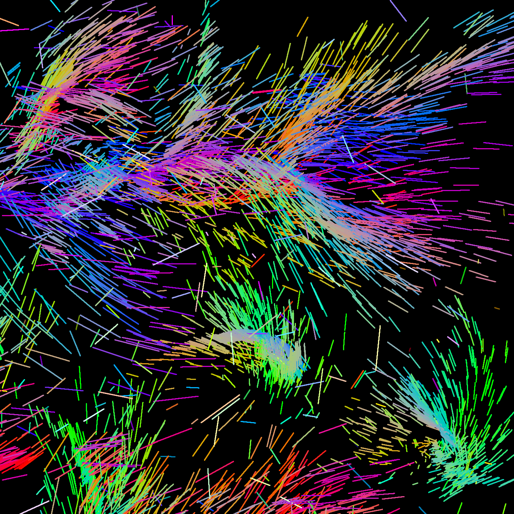

# GPGPU boids
Boid-like particles simulated on GPU, with a custom engine to avoid flowing data through CPU

## Some neato stuff
* The vertex shader reads directly from the array of boids
* If a boid wants to move away from a group of others, it will do so in a spiral pattern, which results in vortexes. Cross products are magic!
* There's a whole, tiny rendering engine in here lmao
